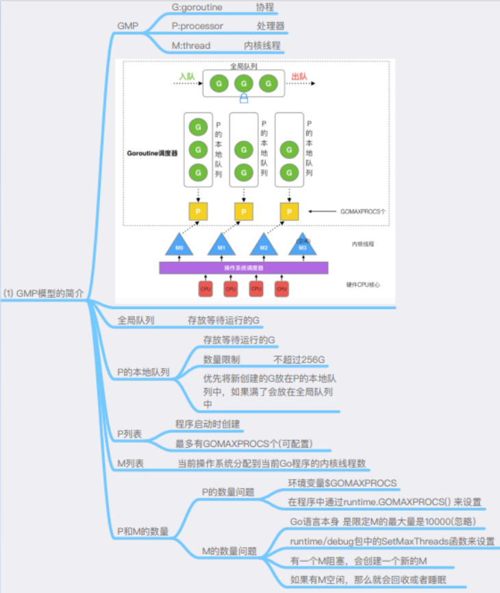

# [八股](https://docs.kilvn.com/GoExpertProgramming/chapter03/3.1-go_schedule.html)

## defer

recover失效有条规则是，recover函数必须在defer方法直接调用

## 切片与map

### 切片扩容

如果切片的容量小于 1024 个元素，于是扩容的时候就翻倍增加容量。总容量从原来的1个翻倍到现在的2个。一旦元素个数超过 1024 个元素，那么增长因子就变成 1.25 ，即每次增加原来容量的四分之一

## 协程调度

g:go的协程，一般是平时执行的工作任务
m:工作线程，一般与p一一对应
p:概念上的处理器在m的上层，主要表示go协程执行的系统资源，并带有调度的作用

go协程的状态:grunnable,gidle,gdead,gwaiting,gsyscall,grunning

go协程在刚开始创建后，会进入gidle的状态，然后挂载在一个p队列进入grunnable状态，如果p队列满了的话会放在全局队列中。
grunnable可以从grunning,gwaiting,gsyscall转换而来，其中gsyscall状态可以直接变成grunning，gdead则由grunnable转换而来

为保证不出现饥饿的情况，通过时间片轮转的方式将grunning转换成grunnable。且如果出现不同P分配的G不均衡，如一个P的所有任务都执行完成此时全局队列也没有存在G，就会发生窃取现象从其他P中窃取一半的G用来执行。

其中gsyscall这种状态是尊重系统调用的那一部分延迟设立的状态，和gwaiting作用差不多但gwaiting是由用户的channel，定时器等阻塞方法导致的。

### 阻塞

一般M数量一般会比P略大一点，所以存在M池子。
用户态阻塞(只是阻塞G)例如网络IO、阻塞式channel、sleep等场景(简单来说就是CPU这时候对于这个协程没有事情要做)，对于这类阻塞会将G暂时挂起到某一临时等待队列中，待阻塞结束后重新寻找P放入。
而发生系统调用级阻塞时，会将MP进行分离，如果有空闲的M就直接用或者是从M池中取，如果都没有就创建一个新的M来服务于这个P。然后将能继续执行的g队列挂在此M上，只要P不空闲就能保证充分利用CPU。而当原来的M在系统调用或阻塞结束后被唤醒有两种情况1.如果有空闲的P则会继续被分配P继续执行被阻塞任务。2.如果没有则将该G放入全局队列，自身放入M池子休眠。

## 内存控制

### 逃逸分析

append如果发生扩容，切片的地址会发生变化。append改变的切片，对原始切片可能不影响，所以传切片进去append时需要多多注意。

栈上分配内存比在堆中分配内存有更高的效率
栈上分配的内存不需要GC处理
堆上分配的内存使用完毕会交给GC处理
逃逸分析目的是决定内分配地址是栈还是堆
逃逸分析在编译阶段完成

如果函数外部没有引用，则优先放到栈中；
如果函数外部存在引用，则必定放到堆中；

所以一般情况下穿指针出去，必定发生逃逸。栈空间不足也会逃逸，闭包也会逃逸，入参是接口也会逃逸，因为是在编译期间完成的逃逸分析无法确定类型。

## make的实现

## chan的底层

## 锁的底层

## 应用场景

### 单向channel的应用场景

timer包中的实例会返回一个单向实例，单向通道有利于代码接口的严谨和安全。