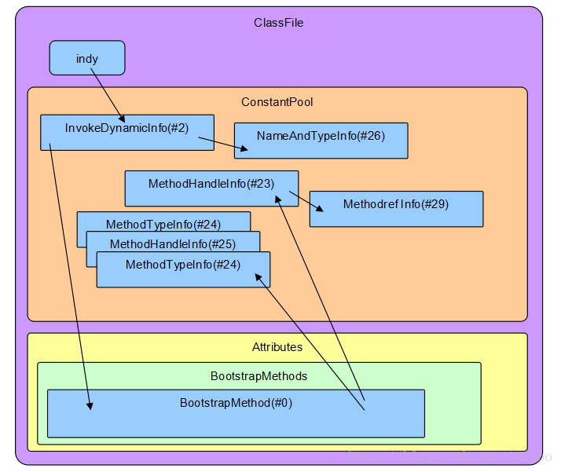

# jvm

## 类文件格式

## classFile结构

### attrubute表

BootstrapMethods:

```
BootstrapMethods_attribute {
    u2 attribute_name_index;
    u4 attribute_length;
    u2 num_bootstrap_methods;
    {   u2 bootstrap_method_ref;
        u2 num_bootstrap_arguments;
        u2 bootstrap_arguments[num_bootstrap_arguments];
    } bootstrap_methods[num_bootstrap_methods];
}
```

引用关系:



## 运行时数据区域

### 程序计数器

jvm支持多线程并发执行，每个线程都拥有自己的程序计数器，程序计数器记录着当前jvm指令执行的地址。如果此时执行的方法是本地方法，则程序计数器的值为null。

### java虚拟机栈

java虚拟机栈为每个线程私有，由一个个栈帧组成。栈帧的内存分布并不需要连续的，由堆空间进行分配，虚拟机栈只负责弹出和压入。虚拟机栈空间的大小可以选择固定大小或动态扩充压缩。当jvm栈是固定大小的，则每个jvm栈的大小在创建时可被独立决定。jvm需要提供给程序员或使用者动态控制jvm stack大小的方法，且包含可控制的最大和最小增删尺寸。如果一个线程请求的栈深度超过允许将会抛出StackOverFlowError，如果jvm stack大小是可动态扩充的，则如果扩充超过可使用内存大小会抛出OutOfMemoryError。

### 堆

堆内存为所有的jvm线程共享，用于存放对象实例，如果不能内存空间不能满足堆内存的扩充将抛出OutOfMemoryError。(虚拟机规范说对象实例，数组都应该在堆上分配。但是现在逃逸分析技术的日渐强大，即时编译技术的进步，或许可以直接用栈上分布等手段提高效率。)

### 方法区

方法区类比传统语言的被编译后代码存储区间或者说操作系统进程的文本段。它存储每个类的运行时常量池，字段和方法数据，方法和构造函数的代码，以及类，实例，接口初始化时的特殊方法`实例<init>,类<cinit>`。虽然方法区从逻辑上属于堆，但可以既不进行垃圾回收也不进行收缩扩充空间，jvm规范也并不指定方法区的位置和已被编译后的代码的管理策略。JDK8以前，HotSpot虚拟机采用堆上永久代的方式设计方法区，用于统一内存的回收管理。但这种方法从现在来看并不是一种合理的方案，因为这样使得方法区局限于-XX:MaxPermSize上限的大小。而像JRockit，IBM J9是不存在永久代的，可以使得方法区的大小触碰到可用内存的上限。JDK8以后HotSpot也采用直接内存的方式，即元空间，去存储方法区内的数据。

### [运行时常量池](https://docs.oracle.com/javase/specs/jvms/se8/html/jvms-4.html#jvms-4.4)

运行时常量池从属于方法区，是每个类，接口的constant_pool表在运行时的表现形式，它包含了从编译期就已知的字面量到在必须在运行时才被解析的方法，字段引用。运行时常量池服务于方法，类似于传统编程语言里的符号引用表，但是包含更广泛的数据。所以jvm的指令并不依赖class,interface,instances等在运行时的布局位置，而是引用constant_pool表中的符号信息(即能通过无歧义的符号定位即可)。constant_pool表中的每一个数据项都具有如下通用格式，其中tag为一字节大小表示cp_info的类型。

```
cp_info{
    ul tag;
    ul info; //一般为索引或者具体字符信息
}

tag type:1.Utf8(用来表示二进制类或接口名),3.Integer,4.Float,5.Long,6.Double,7.class,8.String,9.Fieldref,10.Methodref,11.InterfaceMethodref,12.NameAndType,15.MethodHandle,16.MethodType,18.InvokeDynamic。
```

`CONSTANT_NameAndType_info`:用作描述无关类或接口信息的字段或方法，其中info包含`name_index`(由`CONSTANT_Utf8_info`结构表示字段或方法名字，通常为[有效非限定名](https://docs.oracle.com/javase/specs/jvms/se7/html/jvms-4.html#jvms-4.2.2)或者`<init>`特殊名字。)和`descriptor_index`(由`CONSTANT_Utf8_info`结构表示字段或方法的描述符)组成。

`CONSTANT_InvokeDynamic_info`:为indy指令指定启动方法，info包括`bootstrap_method_attr_index`和`name_and_type_index`。

## 类加载

### 概述

java虚拟机的启动，通过使用bootstrap class loader创建一个包含main方法的初始类启动。先连接该类，然后初始化，最后调用该类的main方法，由main方法的内容进一步进行后续更多的指令。jvm的类加载由的加载，连接，初始化类和接口组成，此处主要介绍了：1.如何从二进制形式的类或接口获取符号引用。2.解释加载，连接，初始化在jvm里第一次初始化的过程。3.定义二进制形式的类或接口是如何被加载然后创建的。4.详细阐述类或接口连接，初始化以及退出过程和本地方法的binding。

### 创建

类或接口的创建，一般通过另一个类的或接口的引用和反射调用触发。普通类的创建通过使用类加载器加载类的二进制表示文件创建，而数组类则是使用jvm。java有两类类加载器，一类是由jvm支持的bootstrap类加载器，一类是用户自定义的类加载器，每一个用户定义的类加载器都是抽象类ClassLoader的子类。应用程序使用用户定义类加载器用于拓展jvm动态加载和创建类的方式，如可以从网络上加载类，也可以动态生成，也可以使用加密文件。由于双亲委派机制，启动加载的加载器不一定是完成加载动作的加载器，但此时我们仍然定义L初始加载C或L是C的初始加载器。而完成加载动作的加载器，我们称之为L定义C或者L是C的定义加载器。在运行时，一个类或者接口是由其二进制名和相应的定义加载器标识的。对于数组的创建，通过Jvm创建数组类，并标识维度和组成类型。如果组成类型是引用类型，则数组类型c的定义加载器将会被标记为定义引用类型的定义加载器，否则就是bootstrap加载器。在任何时候，jvm都会标记该类加载器为初始加载器(指由组成类型决定的意思？)。

## 加载

对于类加载过程的启动，首先需要验证该类是否已经被初始加载器所标记，如果已经被标记了则不启动创建过程。否则对于bootstrap classloader将会根据classname使用依赖平台的文件系统去寻找其二进制表示，而对于user-defined class loader将会调用loadClass()方法去寻找，最后标记该类的初始加载器。当loadClass方法被调用时，如下两个步骤之一将必须被执行：1.创建一个byte数组去表示类的二进制ClassFile结构，然后再通过defineClass方法调用虚拟机去派生类或接口。2.委派其他loader执行上述步骤。

### 加载的约束

对于任意出现在方法返回，或属性参数的名字为N的类型信息，无论是被哪个加载器加载都必须返回相同的类。而为了保证这一点，JVM在准备和resolution阶段施加加载约束，特别在标记加载器为初始加载器时，jvm会立刻检查是否违反加载约束，如果是将撤销标记并抛出LinkageError。JVM检查类加载约束是否被违反，通过判断是否满足以下四个条件：1.loader L被记录名为N的类C初始加载器。2.loader L'被记录为名为N的类C'的初始加载器。3.通过施加的约束条件表明NL = NL'。4.C!=C'。

### 从二进制文件派生class

class对象的派生通过如下几个步骤完成:1.jvm判断是否该class对象已经被标记了loader，如果是则抛出LinkageError终止创建尝试。2.尝试解析目标二进制文件，但是在该过程中将会产生如下错误：目标文件的结构不对抛出ClassFormatError;目标版本不对抛出UnsupportedClassVersionError(ClassFormatError的子类);目标不存在则抛出NoClassDefFoundError。

### 符号引用

在二进制表示的class和interface中的`constant_pool`表，在class或者interface被创建时用来构造运行时常量池。所有的引用在运行时常量池最初都是符号引用的，在运行时常量池的符号引用派生于如下几类：1.派生于`CONSTANT_Class_info`结构的类或接口符号引用。如果是非数组的则返回对应标识符，基本类型有对应的标识符，类则是L跟随二进制类名和`;`,如果是n维数组则在此基础上加上n个`[`前缀。
