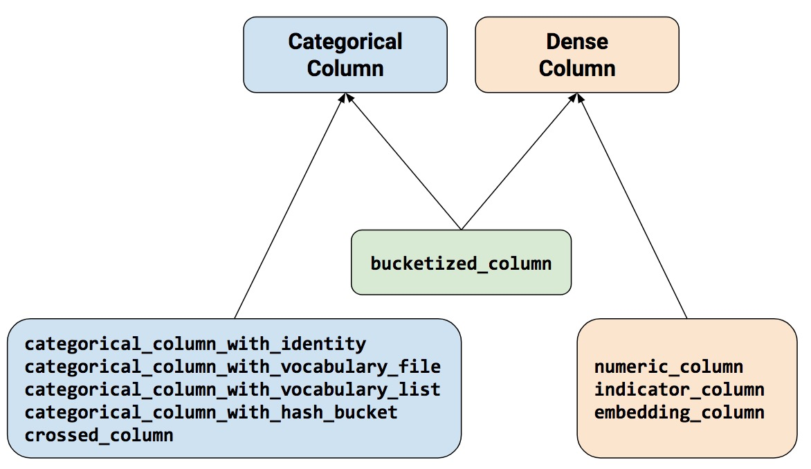

# tensorflow https://blog.csdn.net/kangshuangzhu/article/details/106851826

## tfrecord

创建tfRecord的example实例:

```python

value_city = u"北京".encode('utf-8')   # 城市
value_use_day = 7                      # 最近7天打开淘宝次数
value_pay = 289.4                      # 最近7天消费金额
value_poi = [b"123", b"456", b"789"]   # 最近7天浏览电铺

'''
下面生成ByteList,Int64List和FloatList
'''
bl_city = tf.train.BytesList(value = [value_city])  ## tf.train.ByteList入参是list,所以要转为list
il_use_day = tf.train.Int64List(value = [value_use_day])
fl_pay = tf.train.FloatList(value = [value_pay])
bl_poi = tf.train.BytesList(value = value_poi)

'''
下面生成tf.train.Feature
'''
feature_city = tf.train.Feature(bytes_list = bl_city)
feature_use_day = tf.train.Feature(int64_list = il_use_day)
feature_pay = tf.train.Feature(float_list = fl_pay)
feature_poi = tf.train.Feature(bytes_list = bl_poi)
'''
下面定义tf.train.Features
'''
feature_dict = {"city":feature_city,"use_day":feature_use_day,"pay":feature_pay,"poi":feature_poi}
features = tf.train.Features(feature = feature_dict)
'''
下面定义tf.train.example
'''
example = tf.train.Example(features = features)
print(example)
```

输出结果

```python
features {
  feature {
    key: "city"
    value {
      bytes_list {
        value: "\345\214\227\344\272\254"
      }
    }
  }
  feature {
    key: "pay"
    value {
      float_list {
        value: 289.3999938964844
      }
    }
  }
  feature {
    key: "poi"
    value {
      bytes_list {
        value: "123"
        value: "456"
        value: "789"
      }
    }
  }
  feature {
    key: "use_day"
    value {
      int64_list {
        value: 7
      }
    }
  }
}
```

## [数据处理](https://zhuanlan.zhihu.com/p/73701872)

特征数据主要包括categorical和dense两类，通过tensorflow中的feature_column来处理。通过五种Categorical function,三种numerical function和一种bucketized_column，总共九种不同函数来表示特征的one-hot。其中categorical column中的with_identity其实和dense column中的indicator_column没有区别都是数值类型转换，只是一个是categorical一个是dense。



* categorical_column_with_identity：把numerical data转成one hot encoding
* categorical_column_with_vocabulary_list or categorical_column_with_vocabulary_file：根据单词的序列顺序，把单词根据index转换成one hot encoding
* categorical_column_with_hash_bucket：对于处理包含大量文字或数字类别的特征时可使用hash的方式，这能快速地建立对应的对照表，缺点则是会有哈希冲突的问题。一般hash_bucket_size大小设置为总类别的2-5倍。

```python
##代码示例

import tensorflow as tf
sess=tf.Session()

#特征数据
features = {
    'department': ['sport', 'sport', 'drawing', 'gardening', 'travelling'],
}

#特征列
department = tf.feature_column.categorical_column_with_hash_bucket('department', 4, dtype=tf.string)
department = tf.feature_column.indicator_column(department)
#组合特征列
columns = [
    department
]

#输入层（数据，特征列）
inputs = tf.feature_column.input_layer(features, columns)

#初始化并运行
init = tf.global_variables_initializer()
sess.run(tf.tables_initializer())
sess.run(init)

v=sess.run(inputs)
print(v)

In [33]:
[[0. 1. 0. 0.]
 [0. 1. 0. 0.]
 [0. 1. 0. 0.]
 [1. 0. 0. 0.]
 [0. 1. 0. 0.]]
```

* crossed_column：特征交叉，在有些情况下，特征独自编码与多维特征交叉后的特征特性会有不一样的结果。该函数不能对hash映射之后的特征进行交叉。

### [feature_column 输入输出类型](https://blog.csdn.net/htbeker/article/details/112266784)

1. 深度模型的输入必须是Dense类型，所有输出是categorical类型需要经过indicator或者embedding的转换才可以
2. indicator, embedding, bucketized的输入不能是原始特征，前两者只能是categorical类型的feature_column, 后者只能是numeric_column

|feature_column|输入|输出|输出是否为dense|
|----|----|----|----|
|categorical_column_with_identity|数值型离散|categorical|N|
|categorical_column_with_vocabulary_list|字符型/数值型离散|categorical|N|
|categorical_column_with_hash_bucket|类别太多的离散值|categorical|N|
|crossed_column|categorical/离散值|categorical|N|
|indicator_column|categorical|one/multi-hot|Y|
|embedding_column|categorical|dense vector|Y|
|numeric_column|数值型连续值|numeric|Y|
|bucketzied_column|numeric_column|one-hot|Y|
