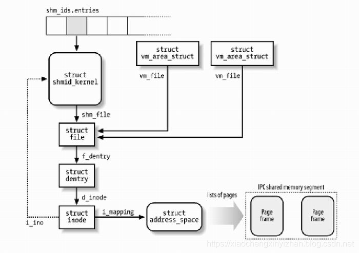

# Linux

## 文件

### open

```c
//相关系统调用
#include <sys/types.h>
#include <sys/stat.h>
#include <fcntl.h>

int open(const char* pathname,int flags);
int open(const char* pathname,int flags,mode_t mode);

int creat(const char* pathname,mode_t mode);

int openat(int dirfd,const char* pathname,int flags);
int openat(int dirfd,const char* pathname,int flags,mode_t mode);

//open系统调用将会通过pathname打开文件，并返回一个最低位的文件描述符。其中如果返回文件描述符后，无论pathname修改或者删除，并不影响文件描述符的后续使用。flags参数表明文件的访问模式，包括:O_RDONLY,O_WRONLY,O_RDWR三种必选其一的模式，以上选项将返回仅可读，仅可写和可读可写的文件，以及属于creation flags的O_CLOEXEC,O_CREAT,O_DIRECTORY,O_EXCL,O_NOCTTY,O_TMPFILE和O_TRUNC可选的ored模式。对于上述两组flags的区别在于，creation flags影响open操作的，file status flags影响后续I/O操作。file status flags可以被恢复以及更改，通过fcntl系统调用。

creation flags和file status flags说明如下：

O_APPEND:文件如果以这种模式打开，在write之前，offset已经被定位在文件的末尾，每一次对文件的写操作和offset的修改都将按一次原子操作被执行(offset不能被自己修改)。O_APPEND可能会导致文件的损坏，当多个进程在NFS文件系统中向文件添加数据时。因为NFS文件系统不支持添加文件，所以用户内核必须去模拟此操作，这种操作是不能在有竞争的条件下进行的。
O_CREAT：文件存在则使用，不存在则新建。
O_EXCL：检查文件是否存在，不存在则新建，存在则返回错误信息。但是此时会有一个问题在于多进程创建文件时，由于检查和创建时分开执行的，可能会导致多个进程同时创建文件。
```

## 共享内存

Linux的2.2.x内核提供多种共享内存方式，如mmap系统调用，Posix共享内存，以及系统V共享内存。Linux发行办法如RedHat 8.0支持mmap()系统调用及系统V共享内存，但还未实现Posix共享内存。

### mmap

mmap系统调用可以通过使多个进程映射同一个普通文件来实现共享内存。实际上mmap并不是完全为了用于共享内存而实际的，它提供了不同于一般普通文件的访问方式，进程可以像读写内存一样对普通文件进行操作，而不是使用read(),write()等方法。

```c
void* mmap(void* addr,size_t len,int prot,int flags,int fd,off_t offset)
// 1.offset表明从该文件的位偏移，一般是0，或者sysconf(_SC_PAGE_SIZE)返回的页大小的倍数。2.fd为想要映射的文件描述符，一般由open()返回。同时fd可以指定为-1，此时必须指定flags参数为MAP_ANON表明匿名映射，避免了文件的创建和打开，但显然只能用于亲缘关系的进程通信。3.flag决定同一个区域的mapping的更新对其他进程来说是否是可见的，是否底层的文件也一起被更新。flag唯一策略组成由下:(1)MAP_SHARED：各进程映射的同区域是对彼此可见的，且允许文件内容写回，此时需要调用msync()函数。(2)MAP_PRIVATE：创建copy-on-write 映射副本，保证彼此之间的映射更新都是不可见的，同时也不能写回文件。其中并没有定义在此情况下,调用mmap()后由文件自身的改变是否对进程可见。flag可或策略组成如下：(1)MAP_ANONYMOUS:表明文件不能被写回，文件的内容被初始化为零，fd的参数将会被忽略，offset参数也应该是0。(2)MAP_FIXED：表明不采用解释addr作为提示，而是直接映射具体的address，但此时对address有诸多要求如是页的整数倍大小等。4.prot描述对于该段内存的安全策略，必须与文件的打开策略不冲突。组成由下：(1)PROT_EXEC:执行权限。(2)PROT_READ：阅读权限。(3)PROT_WRITE：写权限。(4)PROT_NONE：不能访问。5.len表示映射地址空间的长度。6.addr表示内存映射的开始地址，但是如果是NULL则是由内核选择一段地址进行映射，这是比较简单的选择对于创建映射。对于mmap函数调用返回也是本次的addr，对于Linux而言传入该addr会基于该地址附近的页边界来选择开始映射(可能是考虑对齐的问题)。

int munmap(void* addr,size_t length)              //用于解除mmap映射

int msync (void * addr , size_t len, int flags)   //用于将内存内容写回文件

//如下代码将演示创建所需文件页码的内存映射，然后将该部分内容打印至标准输出。该程序的第一行输入为文件的名字，第二行定义offset，第三行定义length。

#include <sys/mman.h>
#include <sys/stat.h>
#include <fcntl.h>
#include <stdio.h>
#include <stdlib.h>
#include <unistd.h>

#define handle_error(msg) \
    do { perror(msg); exit(EXIT_FAILURE); } while (0)

int main(int argc, char *argv[])
{
    char *addr;
    int fd;
    struct stat sb;
    off_t offset, pa_offset;
    size_t length;
    ssize_t s;

    if (argc < 3 || argc > 4) {
        fprintf(stderr, "%s file offset [length]\n", argv[0]);
        exit(EXIT_FAILURE);
    }

    fd = open(argv[1], O_RDONLY);
    if (fd == -1)
        handle_error("open");

    if (fstat(fd, &sb) == -1)           /* To obtain file size */
        handle_error("fstat");

    offset = atoi(argv[2]);
    pa_offset = offset & ~(sysconf(_SC_PAGE_SIZE) - 1);
        /* offset for mmap() must be page aligned */

        /* offset for mmap() must be page aligned */

    if (offset >= sb.st_size) {
        fprintf(stderr, "offset is past end of file\n");
        exit(EXIT_FAILURE);
    }

    if (argc == 4) {
        length = atoi(argv[3]);
        if (offset + length > sb.st_size)
            length = sb.st_size - offset;
                /* Can't display bytes past end of file */

    } else {    /* No length arg ==> display to end of file */
        length = sb.st_size - offset;
    }

    addr = mmap(NULL, length + offset - pa_offset, PROT_READ,
                MAP_PRIVATE, fd, pa_offset);
    if (addr == MAP_FAILED)
        handle_error("mmap");

    s = write(STDOUT_FILENO, addr + offset - pa_offset, length);
    if (s != length) {
        if (s == -1)
            handle_error("write");

        fprintf(stderr, "partial write");
        exit(EXIT_FAILURE);
    }

    munmap(addr, length + offset - pa_offset);
    close(fd);

    exit(EXIT_SUCCESS);
}

```

### 系统V共享内存

进程间需要共享的数据被放在一个叫做IPC共享内存区域的地方，然后将共享区域的地址映射到本进程的地址空间。执行程序通过shmget获得或创建IPC共享内存区域，并返回相应的标识符。内核在执行shmget系统调用时，保证创建了一个共享内存区域，初始化该内存区的shmid_kernel结构并在特殊文件系统shm中创建并打开一个同名文件，并在内存中建立起该文件的相应dentry及inode结构，新打开的文件不属于任何一个进程。其中特殊文件系统shm中的文件不能用read()、write()等方法访问，可直接采用访问内存的方式对其访问。在创建了共享内存区域后，使用系统调用shmat()完成映射到进程地址空间的功能。(注意shm的安装点在交换分区上)



```c
#include <sys/ipc.h>
#include <sys/shm.h>

int shmget(key_t key,size_t size,int shmflg)
//shmget返回与key相关的系统V共享内存段的标识符。新返回的共享内存端的size等同于size参数，大小必须是PAGE_SIZE的整数倍。
```
